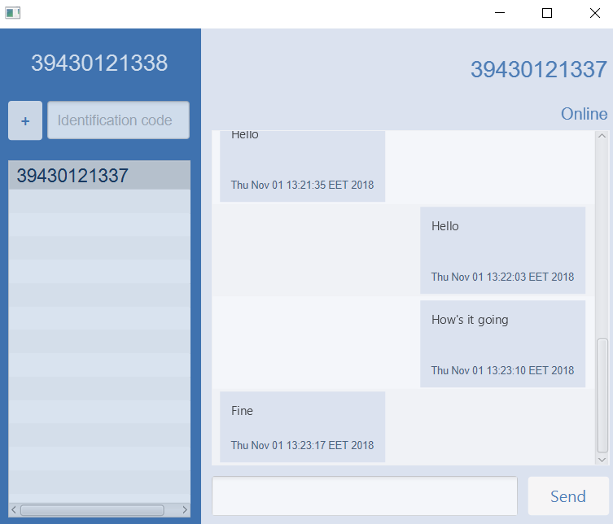
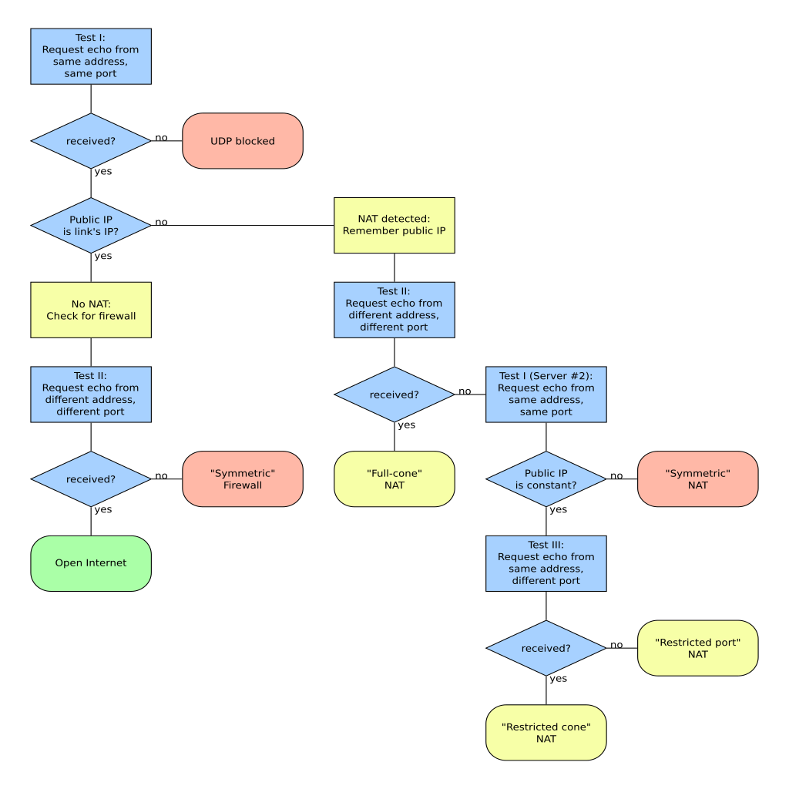

# Idea description

* Encrypted peer-to-peer messaging
* Uses Estonian ID system for both identification and encryption
* Pass messages to offline users by holding them with mutual friends
* Designated servers that pass messages to offline peers

# Milestone 2
## Goals 

- Functional GUI
- EID signing
- Message encryption

## Actual work done 

- Functional GUI
- EID signing utility
- Message encryption
- P2P operations

# GUI

{ width=75% height=75% }

# Next milestone

- EID integration
- Sending messages to offline parties
- NAT traversal
- P2P operation optimization
- Quality of life improvements(use contact name instead of id code)

# Mattias

- Reworked TCP connections between contacts
- Integrated encryption 
- Implemented P2P operations

# Tambet
- GUI

# Jüri

- Research NAT traversial
- Different types of NAT
- ICE 
    - Ice4j (UDP)
    - JSTUN (UDP)
- Recieve public IP and port
- Need to implement a server
    - Port restricted Cone NAT - Accepts only same ip and port where the request was sent.

---
{ width=75% height=75% }
Source: <https://commons.wikimedia.org/wiki/File:STUN_Algorithm3.svg>

# Andrew

- Generate RSA key pair
- Use EID to sign public key
- Verify signed public key
- Generate and encrypt AES key with public key
- Decrypt AES key with private key
- Encrypt/decrypt AES messages
